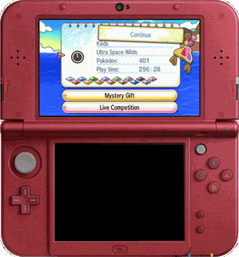

# Shiny Hunter USUM (AFK)

A Windows program that does the shiny hunting on Pokémon Ultra Sun / Ultra Moon
for you. It watches the 3DS screens through NTR-HR streaming, presses the
buttons through input redirection, soft-resets the game round after round, and
stops — with a screenshot and optionally a video — when the shiny shows up.

Thanks to xzn (zbash92 on GBAtemp) for NTR-HR and its greatly improved
streaming stability, to TuxSH for Luma3DS, and to hlixed's TPPFLUSH for the
input redirection, this AFK procedure is possible and, since 2026, a lot more
stable than it was.

- Discussion and walkthrough videos: https://gbatemp.net/threads/shiny-hunter-usum-afk.648378
- Source code: https://github.com/u93132/ShinyHunterUSUM

## Demo

One hunt round captured by the Record tab's AFK mode, framed in the New 3DS XL
console picture (This is compressed to GIF for the purpose of demo and not to 
flood your browser. You can have high quality recording using this app):
[Original quality of this recording](https://github.com/u93132/ShinyHunterUSUM/blob/main/demo/AFK_1_1725.png)



Also a real-time recording of an early version ShinyHunterUSUM works with N3DS:

 Shiny Lugia!.mp4)

## Features

1. Shiny hunting during battles
2. Shiny hunting when receiving Pokémon (Poipole, Type: Null, the starters, Pikachu in a hat)
3. Roto Loto
4. Settings are auto-saved when the PC and 3DS connect; 12 saving slots (Sets)
5. Auto screenshot when a shiny appears
6. Real-time streaming, plus a Record page for screenshots, bursts and videos — including one video per hunt round

Only the English version of the games is supported. The game version is
detected automatically on the first reset:

| Hunt | US/UM | S/M |
|------|:-----:|:---:|
| Battle | all four trigger / type combinations | Move + no aura only |
| Recv | every target | Type: Null (Aether) and the starters |
| Lotto | ✓ | – |

## Limitations

1. English-version gameplay only.
2. This is a real-time streaming / control loop: the latency between PC and 3DS has to be small.
3. Only New 3DS / New 2DS are supported.

## What you need

1. A hacked New 3DS / New 2DS on the latest firmware (11.17) with Luma3DS v13.0 or above.
2. Homebrew **NTR-HR**: https://gbatemp.net/threads/rel-improved-hopefully-ntr-streamer-for-n3ds-xl-ll.644726/
   - Old NTR versions work but do not support multiple instances and crash the 3DS often.
   - A static IP on the 3DS is better, but optional.
3. A network the PC and the 3DS share. Most stable first:
   1. PC wired to the Wi-Fi router, 3DS on the router's Wi-Fi.
   2. PC, 3DS and router all wireless.
   3. A hosted network (mobile hotspot) from the PC's WLAN card — the defaults `192.168.137.1` / `192.168.137.50` assume this.
4. A Pokémon Ultra Sun / Ultra Moon cartridge.
5. The packed `USUMShinyHunter.exe` from Releases, or Python 3.10+ to run from source.

Setting the 3DS clock rate to 268 MHz makes crashes rarer.

## Setup

**PC side**

1. Put the PC and the 3DS on the same network (see above). If Windows asks, make the network **Private** — on a Public network the firewall silently drops the inbound stream.
2. Find your PC IP address.

**3DS side**

1. Install the latest NTR-HR.
2. Press **L + Down + Select** for the Luma menu, then *Miscellaneous options → Start InputRedirection*.
3. Write down the 3DS IP address.
4. Open bootNTR and load NTR 3.6-HR. If you replaced an older NTR, long-press Select when opening it.
5. You are back on the home menu: start Ultra Sun / Ultra Moon.
6. Set the in-game text speed to **fast**.

## How to use

1. Enter your PC IP with the port number (`8001` is NTR's default) in **PC IP**.
2. Enter the 3DS IP in **3DS IP**.
3. Set the counter.
4. Pick a hunt on the Tab radio buttons and configure it on its page (see *Detail settings*).
5. Click the 3DS icon . The log walks through the five steps — TCP link, stream setup, UDP listener, input redirection, hunt — and the window turns **yellow** (Battle), **cyan** (Recv) or **lime** (Lotto) when the hunt is done, **red** if the connection is lost.
6. Click the 3DS icon again to disconnect whenever you want to pause.

- Note 1: the physical buttons of the 3DS are locked during the hunt.
- Note 2: the 3DS icon stays locked for a few seconds after each click while it finishes its work. Please be patient.
- Note 3: NTR fixes its streaming port the first time it initializes. If you change the port in the app, reboot the 3DS.

## Multi-instance

One PC can drive several 3DS. Start the program once per console: each instance locks the first free Set (#1, #2, …) at start-up and on connect, so two instances can never write the same settings or counter. Give each its own stream port:

```
Hunter 1                         Hunter 2
PC IP:  192.168.137.1:8001       PC IP:  192.168.137.1:8002
3DS IP: 192.168.137.50           3DS IP: 192.168.137.60
```

Every saved file carries the instance's Set number (`Encounter_1_0042.jpg`, `Upper_2_0001.jpg`), so instances can share one folder.

## Detail settings

### Battle

Two triggers and two Pokémon types give four kinds of hunt:

| Trigger | Type | Pokémon |
|---------|------|---------|
| Move | no aura | Legendaries in Ultra Wormholes, normal grass encounters |
| Move | with aura | Stakataka, Blacephalon |
| Talk | no aura | (no Pokémon belongs here) |
| Talk | with aura | Ultra Beasts in Ultra Wormholes |

Save right beside (as close as possible to) the event trigger point, or in the middle of the grass.

### Receiving Pokémon

| Target | Where to save | US/UM | S/M |
|--------|---------------|:-----:|:---:|
| **Poipole** | in front of the NPC that gives you Poipole | ✓ | – |
| **Type: Null (Poni)** | on the left of the event trigger point | ✓ | – |
| **Type: Null (Aether)** | in front of the NPC | ✓ | ✓ |
| **Rowlet / Litten / Popplio** | in front of the grass where the event triggers | ✓ | ✓ |
| **Pikachu** | in front of the NPC | ✓ | – |

**Boost** reads the shiny colour straight from the cutscene for Poipole, Type: Null and the starters instead of opening the summary page: much faster per round. Both Type: Null routes share the same check, and it is calibrated on US/UM and S/M footage alike.

### Roto Loto

1. Save away from the NPC so the A presses are not swallowed by conversations.
2. Tick the Roto prizes you want; multi-select is allowed. The hunt stops at the first prize you ticked.

### Record

The Record page captures the stream — during a hunt, or on its own.

1. When the AFK hunt is running the stream is ready to be recorded; the TV icon  mirrors it.
2. Without a hunt, click the TV icon  to start the Record page's own stream.
3. Buttons, left to right (each click cycles to the next icon):
   - **Shot form** —  picture only →  red console →  blue console. The console forms paste the ticked screens into an N3DS XL picture at native resolution (the other screen blacked out) and save as PNG.
   - **Capture mode** —  one shot →  burst →  video (60 s max) →  AFK.
   - **Format** (video modes) —  AVI (MJPEG, the stream's own quality) →  GIF →  APNG.
   - **Run**  — fires the capture; for burst, video and AFK it starts and stops. It pops up when the capture ends and stays greyed out until the file is written.
   - **Only shiny run** (AFK) — keep just the round that found the shiny (default), or every round.
4. The **Screen** checkboxes on the main window choose which screens go in; both ticked gives one combined picture.
5. **AFK mode** records one video per hunt round, from the save-data screen to the shiny check (the newest 200 s of a round are kept, so a frozen game cannot fill memory). When the shiny shows up the hunt lingers a few seconds so the video carries the animation, then the recorder disarms together with the hunt. Arm it before connecting or in the middle of a hunt — recording then starts with the next round.

Files go to the *Save to* folder: `Upper_1_0001.jpg`, `Combined_1_0001.jpg`, `N3DSRed_1_0001.png`, `Video_1_0001.avi`, `AFK_1_0042.avi`… AFK videos carry the round number, matching the hunter's `Encounter_1_0042.jpg` / `Recv_1_0042.jpg`.

The Record page's folder, shot form, capture mode, format and *Only shiny run* are saved per Set like every other setting.

### Undock — a floating Screen window

The  button at the bottom-right of the **Screen** box pops the live screens out into a separate window that follows the main window. It is meant for streaming: give your capture software a clean, fixed-size view of the game instead of the whole app.

- A toolbar across the top:  plain /  red console /  blue console background, then  full and  half size.
- The console backgrounds frame the screens inside an N3DS XL picture; the **Screen** checkboxes choose which screens show (tick one for one screen, both for both).
- The window is titled **Screen** so Discord/OBS *window* capture can find it. Its title-bar controls are disabled — it can only be opened and closed with the undock button, and it keeps a fixed size and follows the main window so it never drifts off your scene.
- The background and size choices are saved per Set.

While the window is open the docked previews step aside; press the undock button again to close it and bring them back.

## Troubleshooting

- **No stream from 3DS** — the network profile on Windows must be *Private*; check the PC IP and port; reboot the 3DS if you changed the port (see Note 3).
- **Error NNN in the log** — the hundreds digit is the stage: `101` the target's name never appeared; `2xx` walking the dialogue; `3xx` starter selection; `5xx` summary page; `6xx` Boost cutscene check. A `Debug_*` screenshot of that moment is saved next to the exe.
- **Red window, "N3DS crush?" / "3DS connection lost"** — the console stopped answering; the app has unlocked itself, check the 3DS and reconnect.
- **"Setting #N locked by another instance"** — that Set belongs to a running instance; pick another one.
- **Discord/OBS cannot find the undock window** — use *window* capture and pick the window named **Screen**; if it still will not list, capture the whole monitor instead.

## Running from source / building the exe

```bash
py -3 -m pip install -r requirements.txt
py -3 USUMShinyHunter_GUI.py
```

`make.bat` packs the single-file exe with PyInstaller (Python 3.10+ required).

## Updates

- v0.3.4: fixed receiving Type: Null.
- v0.3.5: full IP address support.
- v0.4.0: starter Pokémon added — save in front of the grass where the event triggers.
- v1.0.0: recording functions, Pikachu in a hat, Sun / Moon officially supported.
- v1.1.0: Record page capture modes (burst, 60 s video, one video per AFK round with *Only shiny run*), AVI / GIF / APNG output, red and blue console shot forms, per-Set Record settings, Set-numbered filenames for multi-instance, and the hunt lingers after a shiny so the video keeps the animation.
- v1.2.0: Floating Screen window & S/M starters

**2026 edit.** Most of the potential bugs are cleaned up and template matching is faster. Features that depended on low latency were removed. Thanks to AI, programming is much faster now — whether that is a good sign or not.

## Acknowledgements

- [NTR-HR](https://github.com/xzn/ntr-hr/tree/ntr_bins) by xzn (zbash92 on GBAtemp) — screen streaming
- [TPPFLUSH](https://github.com/hlixed/TPPFLUSH) by hlixed — input redirection
- [Luma3DS](https://github.com/LumaTeam/Luma3DS) by TuxSH — custom firmware

## License

See [LICENSE](LICENSE).
